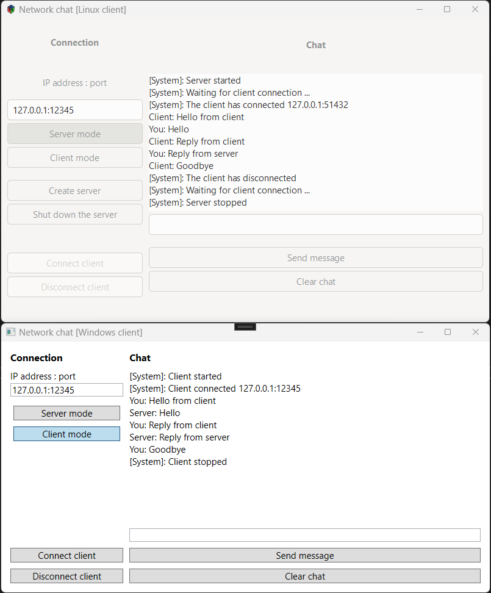

### <div align="center"><b><a href="README.md">Readme on English</a> | <a href="README-RUS.md">Readme on Russian</a></b></div>

# NetworkChat

## Назначение продукта
Графическое клиент-серверное приложение для обмена текстовыми сообщениями

## Предварительные
- Установить Visual Studio 2022 Community Edition

## Сборка проекта под Windows
- Редактировать UI под WIndows в Visual Studio `NcMainPage.xaml`
- Публикация проекта NcWpf

## Установка GLADE под Windows
- Установить [MSYS2 - Software Distribution and Building Platform for Windows](https://www.msys2.org/)
  - Скачать установщик `msys2-x86_64-20250622.exe`
  - Установить в каталог C:\msys64
  - Запустить MSYS2 из меню Пуск
  - Выполнить в консоли MSYS2 `pacman -S mingw-w64-x86_64-glade`
  - Запуск GLADE для Windows UI `c:\msys64\mingw64\bin\glade.exe`

## Сборка проекта под Linux
- Редактировать UI под Linux в GLADE `NcMainWindow.glade`
- Публикация проекта NcGtk

## Установка GLADE под Linux
```sudo apt-get install glade```

## Запуск под Ubuntu Linux
- Установить VirtualBox
- Установить Ubuntu
- Установить VirtualBox Guest Additions
  - VirtualBox - Devices - Insert Guest Additions CD image
  - Установить Guest Additions
```
sudo apt update
sudo apt upgrade -y
sudo apt install build-essential dkms linux-headers-$(uname -r)
cd /media/<UserName>/VBox_GAs_7.1.12
sudo sh VBoxLinuxAdditions.run
```
- Установить GTK3 для запуска NcGtk
```
sudo apt update
sudo apt install -y build-essential libgtk-3-dev pkg-config
```
- Установить .NET SDK для запуска NcGtk
```
sudo apt update
sudo add-apt-repository ppa:dotnet/backports
sudo apt install dotnet9
# sudo apt install dotnet-runtime-9.0
# sudo apt install aspnetcore-runtime-9.0
# sudo apt install dotnet-sdk-9.0
dotnet --version
dotnet --list-sdks
```
- Установить [LocalSend](https://localsend.org/ru) для обмена файлами по локальной сети
```
sudo snap install localsend
localsend
```
- Запустить NcGtk
```
cd ~/Downloads/NcGtkRelease
dotnet NcGtk.dll
```

## Скриншоты
<p align="center"></p>
